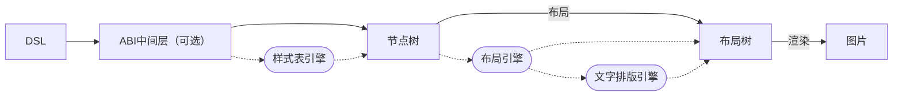

# 项目 | Nitre Engine 设计文档

:::tip
这里目前是超早期设计，可能和最终版有亿点点差距。

没写完，持续更新。
:::

## 版本

当前版本：V1。

## 定位

首要目标：实现静态超文本的布局、排版，并输出到图片。

## 路线图

- [ ] [NitreCanvas](#NitreCanvas)：一个基于 `skia-safe`，实现几乎与 Web Canvas 的 API 相同的绘图库。
- [ ] [NitreStyle](#NitreStyle)：样式表引擎。
- [ ] [NitreLayout](#NitreLayout)：布局引擎。
- [ ] [NitreTypography](#NitreTypography)：文字排版引擎。

## 工作流程



## 设计原则

### 数据不可变

[节点树](#节点树)与[布局树](#布局树)在构造之后，便不再改变。布局过程中，获取到节点树的不可变引用，然后生成布局树。渲染同理。

这要求对数据结构中涉及到的值类型做明确的区分。参考 CSS 的设计，节点树中储存计算值，布局树中储存使用值。

### 类型严格

借助类型系统规避运行时错误。尽可能减少 Map 的使用，使用静态的结构体代替，如元素的样式在 DSL 中可能以 Map 表示，但在节点树中将被转化为结构体。这会导致同一属性由不同的结构体定义，但这些结构体中有一些相同的公有的字段。这种情况下，使用 traits 实现读取信息的接口。

另一方面，尽可能使“无效的数据”和“不合法的数据”在类型系统上被阻止。例如，节点树中的元素尽可能少地拥有无法生效的样式。

## DSL 设计

DSL 根据不同编程语言的特点，设计不同的 DSL。

第一梯队支持的语言有 Python 和 Rust，其后是 C++，再是 Kotlin（Native 和 JNI）。

具体细节尚未确定。

## ABI 中间层

可选。采用 C-like ABI，以扩充前端 DSL 的语言适用范围。

具体细节尚未确定。

## 节点树

节点树模仿前端 **VDOM 的结构**（而不是完整的 HTML DOM），包括两种节点：`Text` `Element`。其中`Element` 包括`Paragraph` `Image` `Box` ，相当于 HTML 的 `<p>` `` `<div>` 。

节点树设计的**第一要素是清晰，第二要素是简单**，易构造性不在考虑内。构造节点树交由 DSL 处理。

不需要引入 JSX Fragment，使用 `Block` 或 `Span` 的功能代替。

```Rust
enum Node {
    Text(String),
    Element(ElementNode)
}
```

### 元素（Element）

HTML 的元素都有 Tag Name、Attributes、Styles、Children 四部分数据。

根据类型严格性要求，Nitre 元素不包含 Tag Name，使用枚举类型取代。同样，Attributes 储存为结构体成员，不使用字典。

Styles 全部为内联样式，使用结构体储存，包含**所有**可用的样式数据。不支持从父节点继承样式，也不支持重叠样式表，这部分由 DSL 解决，或者 Nitre 提供一个样式表引擎。为了在不同对象的样式类型之间提取数据，提供一系列只读的 traits 接口。

Children 使用动态数组储存。

```Rust
struct ElementNode {
    elem_type: ElementType,
    children: Vec<Node>,
}

enum ElementType {
    Paragraph(ParagraphAttributes),
    Image(ImageAttributes),
    Block(BlockAttributes),
    Span(SpanAttributes),
}
```

#### Paragraph

Paragraph 表示一个段落或文本块。

Paragraph 没有 Attributes。

#### Image

#### Block

#### Span

## 图片资源

Nitre 中的图片资源有三种形式：资源形式、视图形式和使用形式。

### 资源形式

资源形式表示内存中的一张图片（储存为 `skia_safe::Image` 或 `skia_safe::Picture`）或渐变纹理（由 `NitreCanvas` 定义）。

```rust
enum ImageAsset {
    Image(skia_safe::Image),
    Picture(skia_safe::Picture),
    Gradient(...),
}
```

### 视图形式

视图形式为资源形式附加一系列布局数据，描述了一个图片资源如何在指定大小的视图内定位。布局数据包括宽高、锚点、重复方式等。

宽高描述了图片资源的宽高，而非视图的大小，后者将在使用时指定。此属性将会影响图片的缩放。两个特殊的属性值 `cover` 和 `contain` 分别表示保持宽高比缩放到最小的能充满视图的大小，以及不缩放。

锚点描述了图片原点（左上角）在视图内的坐标。此含义与 PS 等软件中的锚点有所差异。

重复方式在 x 和 y 两个维度上分别指定，包含四种：`repeat` `space` `round` `no-repeat`，含义与 CSS 的 `background-repeat` 相同。

```rust
enum ImageSize {
    Static { width: Length, height: Length },
    Cover,
    Contain,
}
struct ImageAnchor { left: Length, top: Length }
enum ImageRepeatAttribute { Repeat, Space, Round, NoRepeat }
struct ImageRepeat { x: ImageRepeatAttribute, y: ImageRepeatAttribute }

struct ImageView {
    asset: ImageAsset,
    size: ImageSize,
    anchor: ImageAnchor,
    repeat: ImageRepeat,
}
```

### 使用形式

视图形式的图片在排版后转为使用形式。使用形式同样是在资源形式的图片上附加一系列信息，此时的信息供渲染使用，包括缩放比、渲染位置。

缩放比无需解释。渲染位置确定一系列点，作为图片资源每一次渲染时左上角的坐标。视图形式的样式给出的渲染位置是一系列均匀的格点，所以可用起始点、两个方向的步长、终点来表示。

使用形式的目的一是方便直接渲染，二是将视图形式中的[计算值](#值)转为[使用值](#值)。

```rust	
struct ImageRatio { x: f32, y: f32 }
struct ImageRanderPosition { start: Point<f32>, stride: Point<f32>, end: Point<f32> }

struct ImageRender {
    asset: ImageAsset,
    ratio: ImageRatio,
    position: ImageRenderPosition,
}
```

## 样式

样式定义为一系列 traits，提供只读的样式条目接口，各个元素实现这些 traits。

### 值

在 CSS 中，值分为初始、计算、解析、指定、使用和实际值。Nitre 涉及到的概念较 CSS 简化。

- 初始值的含义与 CSS 的初始值相同。初始值经过样式表引擎处理，不会在节点树中出现。指定元素使用初始值的语法由 DSL 实现。
- 计算值的含义与 CSS 的计算值相同。节点树中储存计算值。计算值的单位可以有 `px` `percent` 等，但不会有 `em` 等，因为这些单位可以由样式表引擎处理并转化为其他单位。计算值可能为 `auto`。
- 解析值在 Nitre 中不涉及。
- 指定值的含义与 CSS 的指定值相同。样式表引擎对指定值进行单位转换，得到计算值储存在节点树中。
- 使用值是完成所有计算后最终使用的值。使用值一般无单位，或者有唯一的单位。使用值不能为 `auto`。当使用值可能与计算值不同时，储存在布局树中；否则储存在节点树或布局树中。
- 实际值在 Nitre 中与使用值相同。

### 单位制

#### 长度

长度单位的计算值可用的单位包括：`px` `percent` `em`，以及在部分场合可用的 `auto` 。

```Rust
enum Length {
    Px(f32),
    Percent(f32),
    Em(f32),
    Auto,
}
```

#### 颜色

颜色的计算值直接使用 `skia-safe` 提供的 `Color` 类型，色彩格式为 ARGB。

对于非 ARGB 的颜色，由样式表引擎转换为 ARGB。

```rust
pub use skia_safe::Color;
```

### 盒模型布局

盒模型布局包括块级元素样式和行内元素样式。

`display` 样式指定元素的类型，支持的值有：`block` `inline` `inline-block` `none`。

按照 CSS 盒模型，元素的大小由 Content、Margin、Padding、Border 组成，这在 Nitre 中表示为 `size` `margin` `padding` `border_width`。

`box-sizing` 属性不提供支持，统一使用 `content-box`样式。

```Rust
struct Size { width: Length, height: Length }
struct EdgeSizes { top: Length, left: Length, right: Length, bottom: Length }
enum DisplayStyle { 
    Block { size: Size, position: PositionStyle }, 
    Inline, 
    InlineBlock { size: Size }, 
    None,
}

trait BoxStyle {
    fn display(&self) -> DisplayStyle;
    fn margin(&self) -> EdgeSizes;
    fn padding(&self) -> EdgeSizes;
    fn border_width(&self) -> EdgeSizes;
}
```

### 定位

在 CSS 中，`position` 和 `float` 样式决定元素的定位方式，如下表：

|   样式   |         left         |        right         |         none         |
| :------: | :------------------: | :------------------: | :------------------: |
|  static  |        左浮动        |        右浮动        |         默认         |
| relative |     左浮动+偏移      |     右浮动+偏移      |      默认+偏移       |
| absolute | 绝对定位，float 失效 | 绝对定位，float 失效 | 绝对定位，float 失效 |
|  fixed   | 固定定位，float 失效 | 固定定位，float 失效 | 固定定位，float 失效 |

按照表格，重新划定定位的两个维度。

在 Nitre 中，`position` 有 `static` `float` `absolute` `fixed` 四种取值，它们的行为基本与 CSS 一致。其中 `float` `aboslute` 和 `fixed` 有表示定位的参数。`position` 属性只对 `display: block` 的元素生效。

另一个定位属性是 `relative`，它表示元素相对于原本位置的偏移。

这种表示方式允许了一些超出 CSS 的样式，比如同时为一个元素设置 `position: absolute` 和 `relative` 偏移。

```rust
struct OffsetStyle { x: Length, y: Length }
struct LocationStyle { top: Length, left: Length, right: Length, bottom: Length }
enum FloatStyle { Left, Right, None }
enum PositionStyle { 
    Static, 
    Float(FloatStyle), 
    Absolute(LocationStyle),
    Fixed(LocationStyle),
}

trait LayoutStyle {
    // position 属性位于 DisplayStyle::Block 中
    fn relative(&self) -> OffsetStyle;
}
```

### 背景

背景包含一个或多个图层。每个图层可以包含一个视图形式的图片资源和一个纯色。

绘制时，先绘制图片资源，再绘制纯色。纯色含有 alpha 信息时，将被叠加到图片上。

问题：`background-clip` 支持？

```rust
struct BackgroundLayerStyle {
    image: Option<ImageView>,
    color: Option<Color>,
}

trait BackgroundStyle {
    fn background(&self) -> Vec<BackgroundLayerStyle>;
}
```

## NitreStyle

待设计。

## NitreLayout

待设计。

一点想法：深度优先遍历。

## 布局树

布局树描述了节点的大小和位置。

```Rust
struct Layout {
    
}
```

## NitreCanvas

预期目标：支持 Canvas API 以及一些扩展 API，包括 `Canvas` `Gradient` `Pattern` `ImageSource` `Path`。

### Canvas


## NitreTypography

待设计。

一点想法：参考 servo 的实现和 DirectWrite 的 API。
