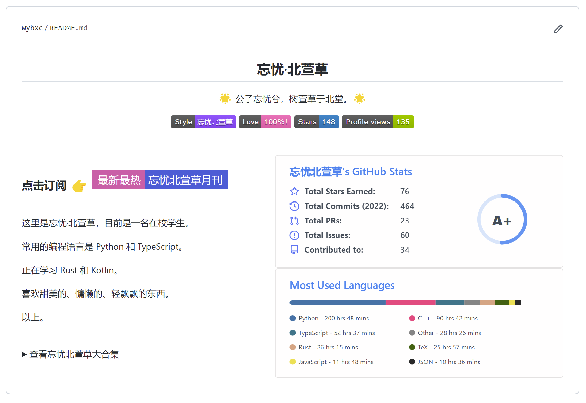
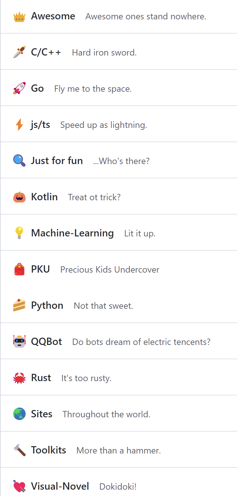

# 笔记 | Github 用户页展示

:::tip
欢迎来到忘忧北萱草的赛博化妆指南。
:::

## 新的 Profile

用户同名仓库可以在 profile 里展示，所以必须得搞点有趣的花样。

目前的我的 profile 长这样：

不过 Wakatime 状态经常因为网络原因加载不出来，所以目前正在筹备把这两个 Card 用 Github Actions 预渲染，进度在[这里](https://github.com/Wybxc/github-stats)。

左右两列的布局是用 `align="right"` 属性，配合已知行高的文本硬搓出来的。看源代码还有用 ` ` 凑空行的奇葩操作。~~所以如果页面宽度不够就会炸掉~~

## 整理 Stars

Star 本来就是收藏夹，所以有 List 很正常吧。

顺便可以加一点睿智吐槽什么的。

