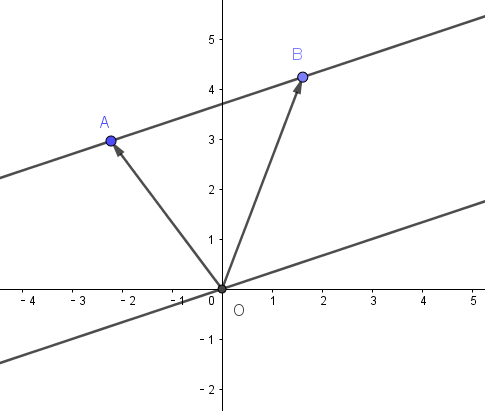

# 文章 | 抽象人的学习笔记：陪集与商群

:::tip
本文首发于知乎。
:::

众所周知，抽象代数之所以难学，就是因为它太抽象了……

这篇文章里，我将分享一下我在学习时建立的一些**直观的具体的理解**。所以行文时，具体的证明常常省略，如果需要，可以参考相关教材。

---
## 群的划分
陪集、商集等一系列概念都来源于群的划分。划分的目的是为了研究群的结构。

所谓**划分，就是把一个集合分为若干个不相交集合的并集**。比如实数可以分为有理数和无理数，整数可以分为奇数和偶数，也可以划分为质数与非质数，*群友可以分为群主、管理员和群成员（划去*

上面的划分中，哪一个才能更好地反映原本集合的结构呢？

从不同的标准来看，答案并不唯一。但是从群论的角度，奇数、偶数的划分更能体现整数的结构。为什么？

偶数是 $$Z^+$$ 的子群，而奇数是由偶数平移（加一）而来，这种结构反映了**平移不变性**。

这就是群划分的一个例子。将 $$Z^+$$ 划分为偶数和奇数，其中包含零元的是子群，另一个则是子群平移而来。

按照这种逻辑，我们还可以找出其他的一些群的划分。比如**按照模n的余数对 $$Z^+$$ 进行划分，这就是数论上的同余类**。

还可以把这种逻辑推广到几何。对于二维向量构成的加法群，我们把它的元素画到平面坐标系中，使原点为起点，这样用终点就能代表一个向量。现在我们作一条过原点的直线，以及它的全部平行线。那么这些平行线就构成了对二维向量加法群的一个划分。

如图， $$\vec{OA}$$ 和 $$\vec{OB}$$ 在划分的同一个子集中。

如何来表示这种划分呢？我们可以找到过原点的直线对应的子集，也就是它的全部方向向量构成的集合 $$H$$ ，那么两个向量$$\vec{OA}$$ 和 $$\vec{OB}$$ 在划分的同一个子集中等价于 $$\vec{OA}-\vec{OB}\in H$$ 。

上面的整数集划分也可以用同样的方法表示。比如记 $$H_0$$ 为所有模n余0的整数的集合，那么 $$a$$ 和 $$b$$ 在同一个同余类中等价于 $$a-b\in H_0$$ 。

于是这是一种泛用性很好的划分方式，因此可以隐藏掉背后的代数结构，用群论的方式表示。对于群 $$<G,\cdot>$$ 的子群 $$H$$ ，在 $$G$$ 的元素 $$a,b$$ 间定义一种关系 $$b^{-1}a\in H$$ ，容易证明它满足反身性、对称性和传递性，因此这是一个等价关系。**满足这样的关系的两个元素处于同一个等价类中**。可以知道，一个群上所有的等价类就构成了群的一个划分。

如何找到这种划分下，群的所有等价类呢？还是从具体的例子出发。在整数集的模n划分中，同余类具有平移关系，也就是说，给 $$H_0$$ 中的元素都加上同一个整数，就得到了另一个同余类。而且分别加 $$0,1,2,\cdots,n-1$$ ，就得到了全部同余类。

推广到一般的群，我们观察给子群 $$H$$ 的元素同时左乘 $$G$$ 中的元素 $$a$$ 会发生什么。

取 $$h\in H$$ ，记 $$b=ah$$ ，那么· $$b^{-1}a=(ah)^{-1}a=h^{-1}a^{-1}a=h\in H$$ ，因此 $$a$$ 和 $$b$$ 在同一个等价类中。

自然，如果 $$a$$ 可以取遍 $$G$$ 中所有元素，那么就能找到 $$G$$ 上全部的等价类。

从这里我们得到了**陪集**的概念： $$aH=\left\{ah|h\in H\right\}$$ 称为左陪集，$$Ha=\left\{ha|h\in H\right\}$$ 称为右陪集。**一个陪集就是一个等价类。对于确定的子群 $$H$$ ，所有的左（右）陪集构成 $$G$$ 的一个划分**。

当然，在 $$a$$ 取遍 $$G$$ 中元素的过程中，得到的陪集会有相同。不难发现，**如果 $$aH=bH$$ ，那么 $$a,b$$ 在同一个等价类中**。

---
## 商集
先确认一件事：对于我的读者而言，“集合的集合”不应该是难以理解的概念。

如果我们想表示 $$G$$ 的一个划分，用全部等价类的集合是最方便的方法。从这里我们得到了**商集**的概念： $$(G/H)_l=\left\{aH|a\in G\right\}$$ 称为左商集， $$(G/H)_r=\left\{Ha|a\in G\right\}$$ 称为右商集。

这样，用商集就能表示群的一个划分了。

当然，如果觉得商集一下子不能接受，我们还可以找一个容易接受的研究对象。正如整数中可以在每个同余类里挑出一个元素组成同余系，我们从每个陪集里挑出一个元素，组成的集合称为**陪集代表系**。

很明显，陪集代表系和商集有一一对应的关系。

对于交换群而言，左陪集和右陪集是一样的，左商集和右商集是一样的。对于一般的群，左商集和右商集有什么关系呢？

事实上，**左商集和右商集之间可以建立一一映射，只要让 $$aH$$ 对应 $$Ha^{-1}$$ 即可**。证明从略。

这表明**左商集和右商集是等势的**。对于 $$G$$ 是有限集的情形，我们把**左（右）商集的元素个数称为子群 $$H$$ 在 $$G$$ 中的指数，记作 $$[G:H]$$ **。

**每个陪集的元素个数都和 $$H$$ 相同**（因为 $$ah$$ 和 $$h$$ 对应），于是可得**拉格朗日定理： $$|G|=|H|[G:H]$$ **。

先留一个问题：为什么商集要叫“商”集？在一般的理解中，商往往是更小的什么东西，而商集确是一个更高阶的“集合的集合”，这违反常理吗？

---
## 正规子群与商群
当 $$G$$ 为交换群时，它所有子群的左商集和右商集是相等的，而对于非交换群，是不是也存在子群使得左商集与右商集相等呢？

考虑三阶交换群 $$S_3$$ 的子群，三阶交错群 $$A_3=\left\{(1),(123),(132)\right\}$$ ，从拉格朗日定理可知 $$[S_3:A_3]=2$$ ，而 $$A_3$$ 本身就是自身的陪集，所以它的补集自然是另一个陪集。刚才的讨论并没有要求是左陪集还是右陪集，因此 $$A_3$$ 的左商集和右商集是相等的。

从这里得出**正规子群**的概念：**使得左商集与右商集相等的子群称为正规子群**。

正规子群 $$N$$ 的左商集和右商集统称为商集 $$G/N$$ 。现在我们想要让商集成为商群，需要定义一种集合之间的运算。

这种运算就是**集合的乘法**：**对于群 $$G$$ 的子集 $$H,K$$ ，定义 $$HK=\left\{hk|h\in H,k\in K\right\}$$ **。把单元素集的运算简写： $$\{a\}H=aH$$ ， $$H\{a\}=Ha$$ ，可以知道这种运算和陪集的定义是一致的。

可以证明**集合乘法满足结合律**。

现在我们来看正规子群 $$N$$ 的商集中元素的乘法： $$(aN)(bN)=a(Nb)N=abNN=(ab)N\in G/N$$ 。从这里可以看出陪集的乘法满足封闭性。通过进一步的论证，可以知道陪集的乘法存在单位元 $$N$$ 与逆元 $$a^{-1}N$$ ，因此**商集在集合乘法下构成群，称为商群**。

---
## 商群为什么叫商群
到这里先打住。因为我学的时候看到商群已经看不懂了。

在上面我就提出了这个问题：为什么一个“更高阶”的子集族要叫做“商”群？

要回答这个问题，还是回到最初的讨论——群的划分。

在划分群时，我们首先找到了一个标准——子群 $$H$$ ，让 $$H$$ 称为一个天然的等价类。然后对 $$H$$ 进行平移（与基本元运算），得到了一系列等价类——陪集。

正规子群就是有更好的陪集性质的子群，它满足左陪集和右陪集相等，于是让商集能构成商群。

在这个过程中，正规子群和商群分别扮演了怎样的角色？

正规子群是一个良好的分类标准。它代表了群中元素的一致性，并且是可平移的一致性。比如把一个年级的学生分组，第一组是学号尾数为1的学生，那么其他的组可以自然地套用第一组的标准，选出学号尾数为2，3，等等的学生。在这个过程中，第一组只提供了“学号尾数相同”这一具有平移不变性的信息，而舍去了“1”这个平移变化的信息。

至于商群，我们从符号的角度出发。（下面的推导会有不严谨之处，仅作为直观理解。）

群 $$G$$ 可以写成一系列陪集的划分： $$G=a_0N\cup a_1N\cup a_2N \cup \cdots \cup a_kN$$ ，其中 $$a_0=e$$ ， $$k=[G:N]$$ 。

把并集看成一种“加法”。 $$G=a_0N+ a_1N+ a_2N + \cdots + a_kN$$ 

两边“约去” $$N$$ 。 $$G/N \cong a_0+a_1+a_2+\cdots+a_k$$ 

这表明，**商群是它的代表元集的一个同构**（事实上确实是）。在群中的一个划分中，“约去”地位相同的元素，剩下的元素就是商群的代表元集。

这就说明了商群为什么要叫“商”。其实商群的代表元集才真正是两个集合的商，但是代表元集在别的方面（同态）的性质不如商群自然，而且由于两者同构，所以从结构上讲并没有太大的区别，就把商群叫做“商群”，连带着商集也叫做“商集”。

**商群反映了群运算的结构**。它舍弃了对具体元素的研究，而保持了运算的性质。在自然同态 $$\pi(a)=aN$$ 下，商群就是群的一个缩影。

