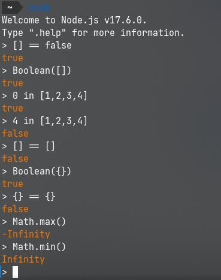
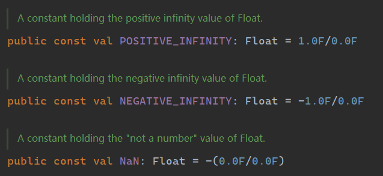

# 笔记 | 一些不知道好不好笑的笑话

:::tip
整理自群聊天记录，感谢群友们的分享。
:::

## C++ 笑话一则

```cpp
auto (auto)
auto = auto;
auto;
```

## mfy

Minimum Function Unit

最小功能单元

把每个单词的第一个音连起来

“mafuyu”

## Welcome to JavaScript



## Welcome to NPM


## Mojang 常数

浮点数可以表示 +inf, -inf 和 NaN（mojang 笑话时间）



## Modern C++


## 交换 py

目睹群友交换 py

结果一名群友是 centos
