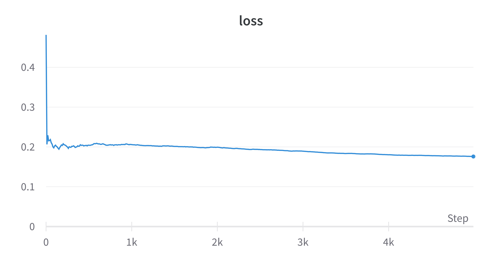
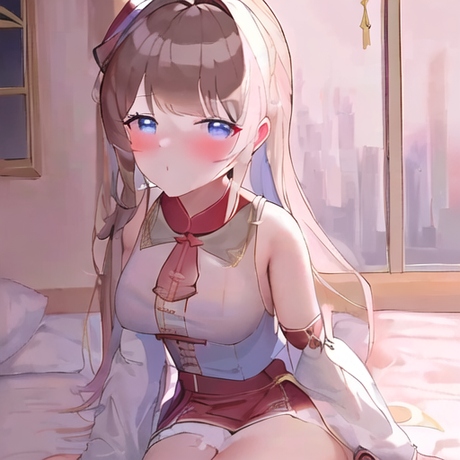

# 创作 | AI 元火娘笔记

:::tip
似乎 AI 绘画已经成了每一期都会有的固定内容了（逃）。
:::

import HM from '@site/src/components/HeiMu'

年前就一直想着要训练一个元火娘的 AI 画图模型，前两天终于有时间实际动手了。

看一下效果：


还是相当不错的。

## Dreambooth

最先训练的模型是 dreambooth 版，因为懒得自己配环境，就直接用了秋叶制作的 autodl 镜像。

本来以为数据集会是个问题，但是去公众号上翻了一下，发现往年的社庆贺图有不少，再加上 Live2D 动一动就能造出许多图，所以数据集还是够用的。
最终训练用的数据集在 40 张左右，不是很多，但是效果还是不错的。

Dreambooth 要求图片是 512x512 的正方形，并且背景尽可能简单。所以在裁剪的时候，为了把姐姐和妹妹分开，很多图片截取了画幅外的部分，再把背景填上白色。

调参有几个值得注意的地方。为了防止过拟合，适当降低 `prior_loss_weight` 的值，我采用的是 0.9。

以及 CLIP skip，一般要改成 2，因为很多模型都是以 CLIP skip 为 2 训练的，如果不改的话，prompt 的组合会受到一点影响。

以 5e-6 的学习率训练 5000 步（大约 120 epoch），在 24GB RTX 3090 上用时 44 分钟，loss 的变化如图：



5000 步之后的效果图为<HM>（我超，嘉然）</HM>：



效果图的人设并不是很贴合，因为生成效果图的 prompt 中没有用 `white hair` 等进一步限定。

实际上之前训练的时候，因为 `prior_loss_weight` 较高，模型在 2000 步的时候就能完美复刻人设，但是过拟合十分严重，以至于非正方形图片都无法正常生成。

模型训练完成后，画风略显粗糙，于是将模型以 9:1 与 Anything 3.0 融合，让画风更加精致。

Dreambooth 模型一共训练了三版，分别是妹妹、姐姐、姐妹同屏。因为 Dreambooth 直接训练出来的是 ckpt 模型，而姐妹模型融合之后并不能同时表达两人的人设，所以额外训练了一版姐妹同屏的模型。

## LoRA

LoRA 是最近提出的一种微调网络结构的方法，可以用 hypernets 级别的参数量达到 dreambooth 的效果（实际上 LoRA 的训练方法就是基于 dreambooth 的）。LoRA 模型的优势在于可以组合到不同的模型上，画风 ckpt + 人设 LoRA 极大提高了组合的灵活度。

因为依然懒得自己配环境，所以还是用了秋叶制作的 autodl 镜像。不过这个镜像明显做的比较仓促，很多可配置的东西都没有设计进去。

LoRA 对于数据集并不要求一定是正方形图片，所以之前为了裁剪正方形而向外扩展画幅的做法就不适用了。而且 LoRA 对于构图的细节比较敏感，而不像 Dreambooth 只提取主体，所以需要确保数据集中有一定比例的全身像。之前用 Live2D 截图做数据集，有很多半身像，结果训练出来要么没有腿，要么腿没有空间逻辑。

LoRA 的数据集中可以指定正则化图像，就像 Dreambooth 的 class images 一样（秋叶的视频教程里没说这一点，点名批评 x），虽然好像不指定也行，但是我没试过。

在 24G A5000 上，batch size 可以调到 8，以 1e-4 的学习率训练 40 epochs。（因为租用的实例已经被释放掉了，所以找不到训练日志了，不过我记得好像是这个参数）

与 Dreambooth 相比，LoRA 不容易出现过拟合（参数就那么点，加上训练过程中看不到参考图所以也不知道有没有过拟合 x），但是对生成时的 prompt 要求更高，如果 prompt 中没有足够的信息，根本无法体现人设。不过有趣的是，prompt 里面往往关键的一两条就能激活模型对人设的记忆，实际上并不需要很细致的描述。

LoRA 模型一共训练了四版，姐妹各两版，分别以 final-prune 和 Waifu Diffusion 1.4 为基底模型，适用于 Stable Diffusion 1.0 和 2.0 的网络结构。（主要是为了能结合 SD2.0 的 PVC 模型）

在画<HM>涩</HM>图的时候，意外发现了姐妹同屏的 prompt。

```text
masterpiece, best quality, <lora:yanhuo:0.55>, <lora:yanyuan:0.45>, 2girls, (([blue eyes], white hair, [short ahoge], side ponytail, pink color scheme)), ([long hair], red eyes, straight black hair, long hair, blunt bangs, ribbon, blue color scheme), sisters, yuri, saliva trail, volume light, depth of field, shadow, sash, looking at another, beautiful detailed sky, blush, dynamic angle, full body, garden,
Negative prompt: lowres, bad anatomy, bad hands, text, error, missing fingers, extra digit, fewer digits, cropped, worst quality, low quality, normal quality, jpeg artifacts, signature, watermark, username, blurry
Steps: 20, Sampler: DPM++ 2M Karras, CFG scale: 8, Seed: 714442909, Size: 512x384, Model hash: f773383dbc, Denoising strength: 0.6, Clip skip: 2, ENSD: 31339, Hires upscale: 2, Hires steps: 20, Hires upscaler: Latent
```

所有 LoRA 的权重加起来不能超过 1.3，否则整个画面会崩掉。测试下来，妹妹 0.55，姐姐 0.45 的比例是最好的（可能是因为白毛要求比较高）。用嵌套括号的方式可以分别指定人设（虽然我也不知道 tokenizer 是怎么处理嵌套括号的，但是 WebUI 的检查器没有报错）。
